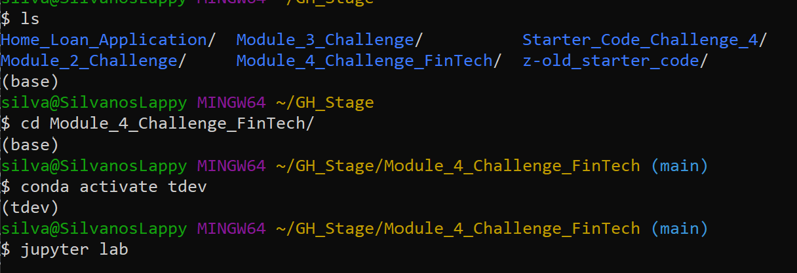
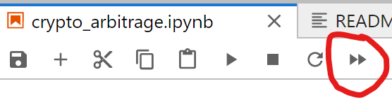

# Arbitrage Analysis

This jupyter lab notebook will take the observer through a financial analysis of 4 major hedge funds using the S&P 500 as the overall market. Namely: SOROS FUND MANAGEMENT LLC, PAULSON & CO.INC., TIGER GLOBAL MANAGEMENT LLC and BERKSHIRE HATHAWAY INC. First, the volatility will be analyzed, next risk, then the sharpe ratios and finally the beta of the 4 funds. A clear picture of which funds offer a sound investment option should be made by the end of this analysis. 

---

## Technologies

Language: Python 3.9.12

Libraries used:

[Pandas](https://pandas.pydata.org/pandas-docs/stable/index.html) - For the creation and visualization of Data Frames

[Jupyter Labs](https://jupyter.org/) - An ipython kernel for interactive computing in python

[Numpy](https://numpy.org/doc/stable/) - A fundamental package for scientific computing

[Matplotlib](https://matplotlib.org/) - Library for visualizations in python

---

## Installation Guide

If you are using an anaconda or a conda environment chances are pandas and jupyter labs are already installed in your virtual environment. The anaconda environment has instances of pandas, numpy and matplotlib. 

If they are not then run:
```python
    pip install pandas
    pip install jupyterlab
```

---

## Usage

To run this jupyter lab notebook you will need to use GitBash and navigate to where you have exported the files associated with this project.

Next you will need to perform the following



This will open a jupyter lab notebook in your default browser. 

Next open **'risk_return_analysis.ipynb'** and click 

This will run the entire notebook. Make sure to follow the pseudocode to see what has been coded and what is being displayed. 

---

## Highlights:

Here are a few snippets of what you can find in this project

### Cumulative Returns:


### Volatility:


### Sharpe Ratios:


---

## Contributors

Created by Silvano Ross while in the UW FinTech Bootcamp
> Contact Info:
> email: silvanoross3@gmail.com |
> [GitHub](https://github.com/silvanoross) |
> [LinkedIn](https://www.linkedin.com/in/silvano-ross-b6a15a93/)

---

## License

[MIT](LICENSE)
